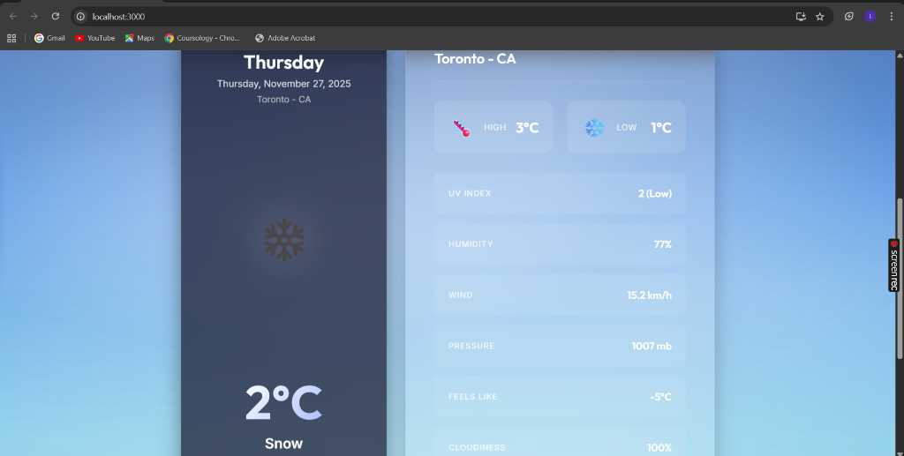
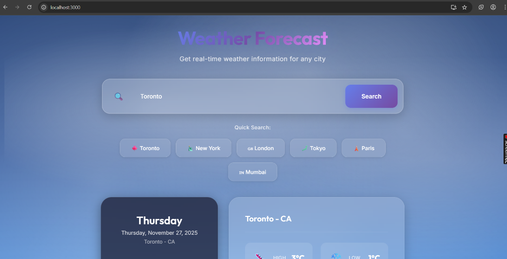

# Weather Forecast App - COMP 3123 Lab Test 2

**Student ID:** 101498470  
**Course:** COMP 3123 - Full Stack Development I  
**Project Name:** 101498470_comp3123_labtest2

## 📋 Project Description

A modern, responsive weather application built with React that provides real-time weather information for cities worldwide. The app features a beautiful glassmorphism design with a sky-themed background, smooth animations, and an intuitive user interface.

## 🌟 Features

- **Real-time Weather Data**: Fetches current weather information from OpenWeatherMap API
- **City Search**: Search for weather information for any city worldwide
- **Quick Search**: Pre-configured buttons for popular cities (Toronto, New York, London, Tokyo, Paris, Mumbai)
- **Comprehensive Weather Details**:
  - Current temperature (Celsius)
  - Weather conditions with animated icons
  - Feels-like temperature
  - High/Low temperatures
  - Humidity percentage
  - Wind speed
  - Atmospheric pressure
  - UV Index (calculated)
  - Cloudiness percentage
  - Sunrise/Sunset times
  - Visibility
- **Modern UI/UX**:
  - Glassmorphism design with blur effects
  - Beautiful sky background with animated clouds
  - Smooth transitions and hover effects
  - Responsive design for all devices
  - Loading states and error handling
- **React Best Practices**:
  - Function components with hooks
  - State management using `useState`
  - Side effects with `useEffect`
  - Props for component communication
  - Axios for API calls

## 🚀 Setup Instructions

### Prerequisites

- Node.js (v14 or higher)
- npm or yarn
- OpenWeatherMap API key

### Installation Steps

1. **Clone the repository**
   ```bash
   git clone https://github.com/YOUR_USERNAME/101498470_comp3123_labtest2.git
   cd 101498470_comp3123_labtest2
   ```

2. **Install dependencies**
   ```bash
   npm install
   ```

3. **Configure API Key**
   - Sign up for a free API key at [OpenWeatherMap](https://openweathermap.org/api)
   - Open `src/App.js`
   - Replace the API key on line 8:
     ```javascript
     const API_KEY = 'your_actual_api_key_here';
     ```

4. **Run the application**
   ```bash
   npm start
   ```
   The app will open in your browser at `http://localhost:3000`

5. **Build for production** (optional)
   ```bash
   npm run build
   ```

## 🔧 Technologies Used

- **React** (v18+) - Frontend framework
- **Axios** - HTTP client for API requests
- **OpenWeatherMap API** - Weather data provider
- **CSS3** - Styling with modern features (gradients, backdrop-filter, animations)
- **Google Fonts** - Inter and Outfit font families

## 🎨 Design Features

- **Glassmorphism Effects**: Semi-transparent cards with backdrop blur
- **Sky Background**: Beautiful gradient sky with animated cloud effects
- **Responsive Layout**: Optimized for desktop, tablet, and mobile devices
- **Smooth Animations**: Fade-in, slide-in, float, and hover effects
- **Color Palette**: Vibrant blues and purples with high contrast for readability
- **Typography**: Modern font stack with Inter and Outfit

## 📡 API Integration

### OpenWeatherMap API

**Endpoint Used:**
```
https://api.openweathermap.org/data/2.5/weather
```

**Parameters:**
- `q`: City name
- `appid`: API key
- `units`: metric (for Celsius)

**Sample Request:**
```
https://api.openweathermap.org/data/2.5/weather?q=Toronto&appid=YOUR_API_KEY&units=metric
```

**Sample Response:**
```json
{
  "coord": { "lon": -79.42, "lat": 43.7 },
  "weather": [
    {
      "id": 800,
      "main": "Clear",
      "description": "clear sky",
      "icon": "01d"
    }
  ],
  "main": {
    "temp": 3.5,
    "feels_like": -1.2,
    "temp_min": 2.0,
    "temp_max": 5.0,
    "pressure": 1012,
    "humidity": 68
  },
  "wind": { "speed": 5.1, "deg": 160 },
  "clouds": { "all": 75 },
  "name": "Toronto",
  "cod": 200
}
```

**Weather Icons:**
Icons are fetched from OpenWeatherMap:
```
http://openweathermap.org/img/wn/{icon_code}@4x.png
```

## 📱 Screenshots

### Main Interface

*Beautiful glassmorphism design with search bar, quick search buttons, and weather display for Toronto showing current conditions*

### Weather Details

*Detailed weather metrics including temperature (2°C), UV Index, humidity (77%), wind speed, pressure, feels-like temperature, and cloudiness displayed in modern glassmorphic cards*

> **Note:** Additional screenshots can be added for search functionality, mobile responsive view, error states, and loading animations.

## 🏗️ Project Structure

```
101498470_comp3123_labtest2/
├── public/
│   ├── index.html
│   └── ...
├── src/
│   ├── components/
│   │   ├── WeatherDisplay.js      # Weather data display component
│   │   ├── WeatherDisplay.css     # Weather display styles
│   │   ├── SearchBar.js           # Search input component
│   │   └── SearchBar.css          # Search bar styles
│   ├── App.js                     # Main application component
│   ├── App.css                    # Main application styles
│   ├── index.js                   # React entry point
│   └── index.css                  # Global styles and theme
├── screenshots/                   # Application screenshots
├── package.json
└── README.md
```

## 🎯 React Concepts Demonstrated

### 1. **State Management (useState)**
```javascript
const [weatherData, setWeatherData] = useState(null);
const [loading, setLoading] = useState(false);
const [error, setError] = useState(null);
```

### 2. **Side Effects (useEffect)**
```javascript
useEffect(() => {
  fetchWeatherData('Toronto');
}, []);
```

### 3. **Props**
```javascript
<WeatherDisplay weatherData={weatherData} />
<SearchBar onSearch={handleSearch} loading={loading} />
```

### 4. **Event Handling**
```javascript
const handleSearch = (city) => {
  fetchWeatherData(city);
};
```

### 5. **Conditional Rendering**
```javascript
{loading && <LoadingSpinner />}
{error && <ErrorMessage />}
{weatherData && <WeatherDisplay />}
```

## 🌐 Deployment

The application can be deployed on platforms like Vercel, Railway, or Render.

**Live URL:** [Your deployed app URL here]

### Deployment Steps (Vercel Example)

1. Install Vercel CLI:
   ```bash
   npm install -g vercel
   ```

2. Deploy:
   ```bash
   vercel
   ```

3. Follow the prompts to complete deployment

## 📝 Notes and Assumptions

- The app uses the **metric system** (Celsius) for temperature
- Default city on load is **Toronto**
- UV Index is calculated based on cloud coverage (not provided by free API tier)
- Weather icons are provided by OpenWeatherMap
- The app requires an active internet connection
- API key must be configured before running the app
- Error handling includes network errors, invalid cities, and API issues
- The free tier of OpenWeatherMap API allows up to 1,000 calls per day
- API responses may take a few seconds depending on network speed
- The app is optimized for modern browsers (Chrome, Firefox, Safari, Edge)

## 🔍 Testing

### Manual Testing Checklist

- ✅ Search for valid city names
- ✅ Search for invalid city names (error handling)
- ✅ Use quick search buttons
- ✅ Test on different screen sizes (responsive design)
- ✅ Test loading states
- ✅ Test with no internet connection
- ✅ Verify all weather data displays correctly
- ✅ Check weather icons load properly

### Postman Testing

API endpoint can be tested in Postman:

**Request:**
```
GET https://api.openweathermap.org/data/2.5/weather?q=Toronto&appid=YOUR_API_KEY&units=metric
```

Expected status: `200 OK`

## 📚 References

- [OpenWeatherMap API Documentation](https://openweathermap.org/api)
- [OpenWeatherMap Weather Conditions](https://openweathermap.org/weather-conditions)
- [React Documentation](https://react.dev/)
- [Axios Documentation](https://axios-http.com/)
- [MDN Web Docs - CSS](https://developer.mozilla.org/en-US/docs/Web/CSS)

## 👨‍💻 Author

**Student ID:** 101498470  
**Course:** COMP 3123 - Full Stack Development I  
**Semester:** Fall 2025

## 📄 License

This project is created for educational purposes as part of COMP 3123 Lab Test 2.

---

**GitHub Repository:** [https://github.com/YOUR_USERNAME/101498470_comp3123_labtest2](https://github.com/YOUR_USERNAME/101498470_comp3123_labtest2)

**Last Updated:** November 27, 2025
